# Netbox Nbservice
[Netbox](https://github.com/netbox-community/netbox) Plugin for ITSM service mapping.

## Compatibility

This plugin in compatible with [NetBox](https://netbox.readthedocs.org/) 2.10 and later.
Tested in versions: 2.10.6; 2.11.12; 3.1.11; 3.2.1

## Installation

Add the following line to /opt/netbox/local_requirements.txt with
```
nb-service
```

Enable the plugin in /opt/netbox/netbox/netbox/configuration.py:
```
PLUGINS = ['nb_service']
```

Runs /opt/netbox/upgrade.sh

```
sudo /opt/netbox/upgrade.sh
```

# Screenshots

## Versions 2.X

### Service List

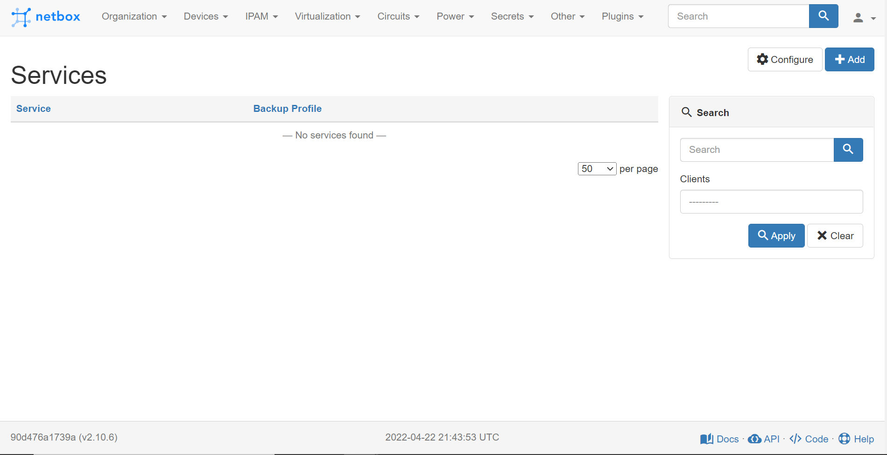

### Service View

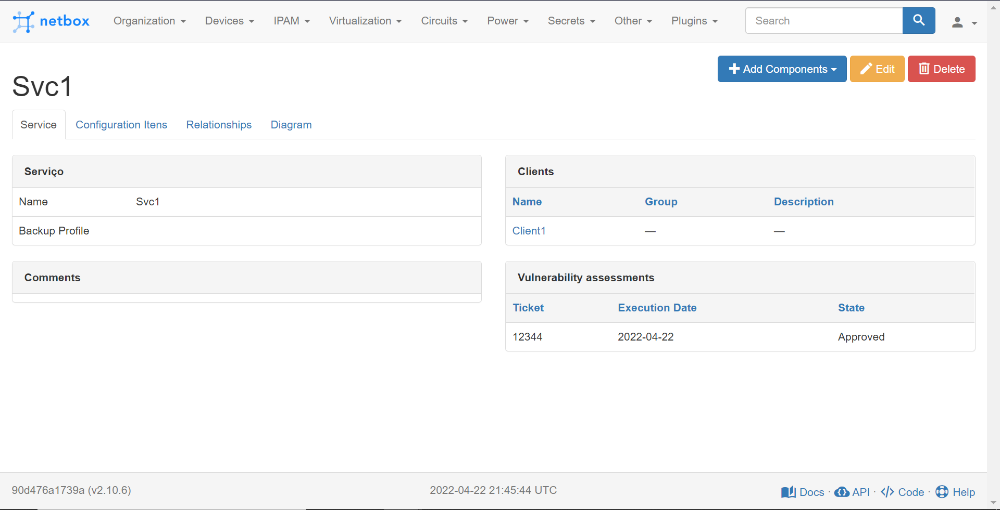

### Service Relations


### Service Diagram

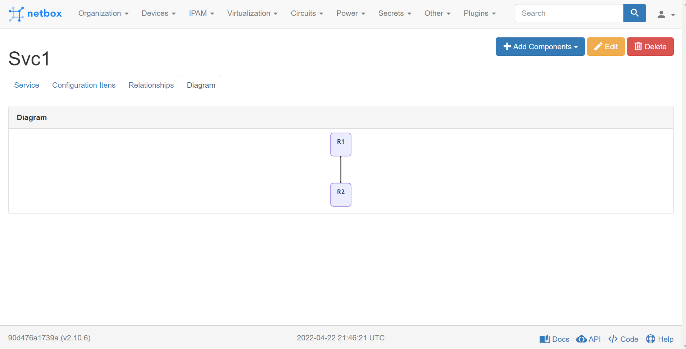

### Application List

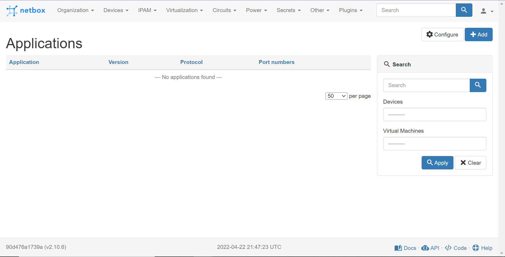

### Application View


### Application Devices

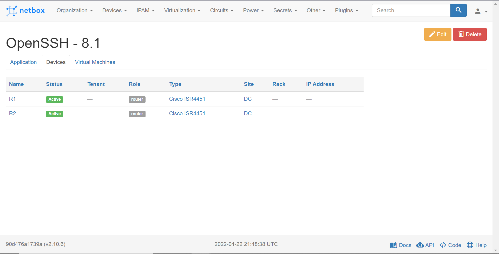

## Versions 3.X

### Service List

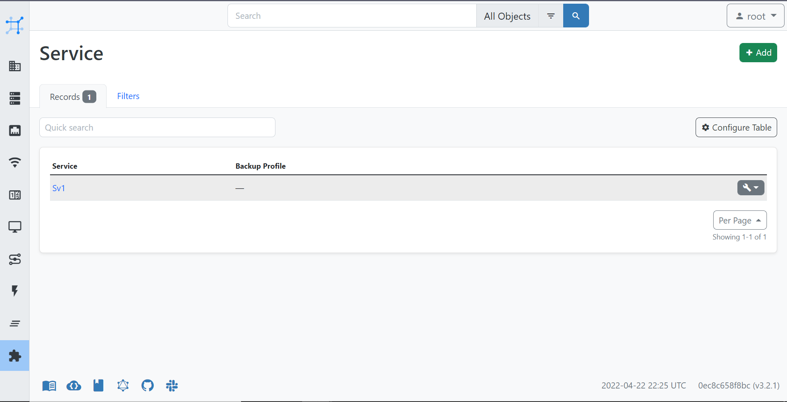

### Service View

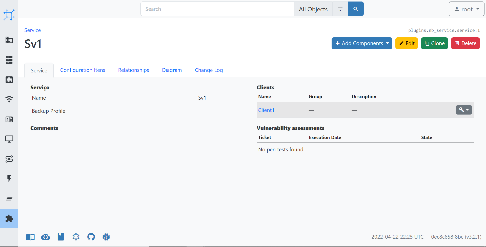

### Service Relations

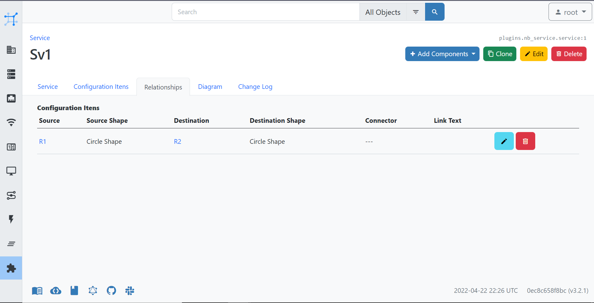

### Service Diagram

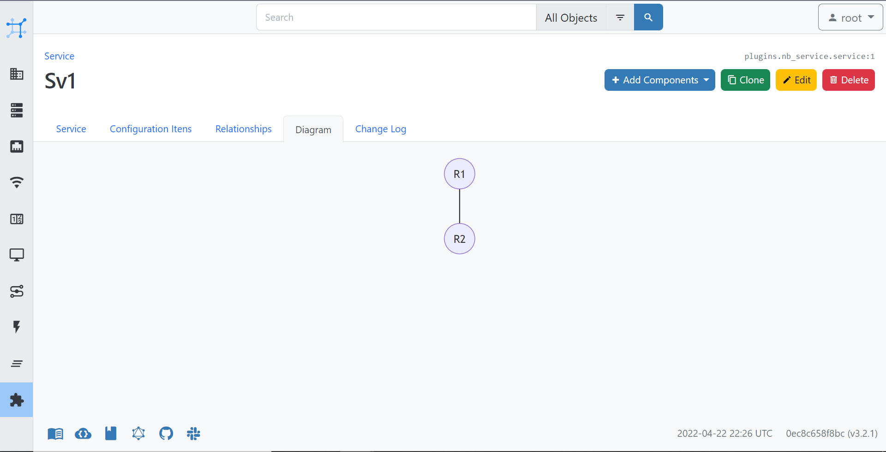

### Application List

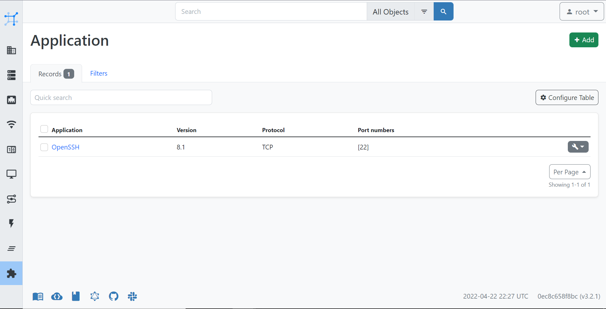

### Application View

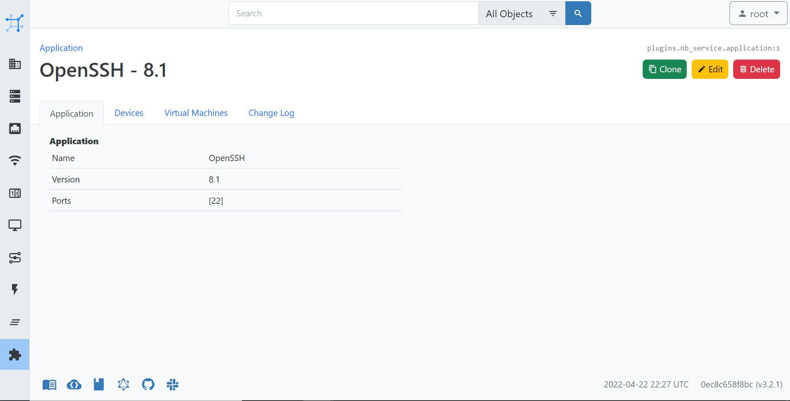

### Application Devices

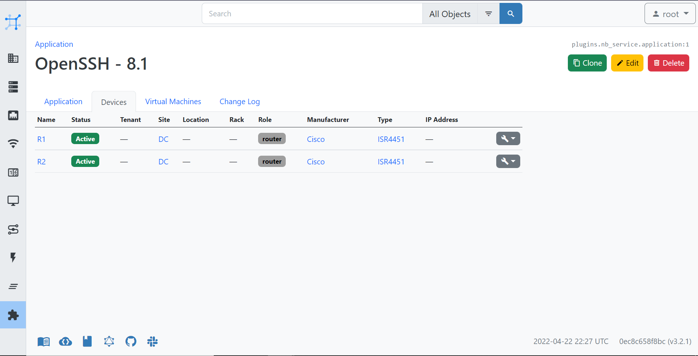
